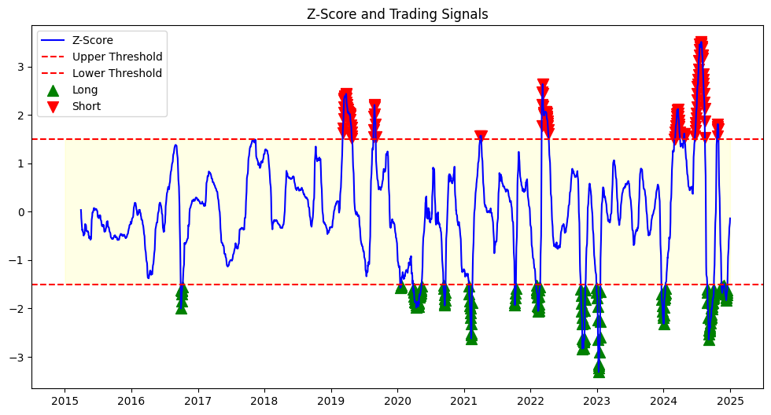

# Mean-Reversion Statistical Arbitrage Strategy

This repository implements a **mean-reversion statistical arbitrage (pairs trading) strategy** on stock pairs, using Python. The project demonstrates **quantitative trading workflow**, including data collection, cointegration analysis, signal generation, and backtesting with realistic transaction costs.

All plots and results are saved in the `results/` folder.

---

## **Project Structure**

```bash
mean_reversion_stat_arb/
│
├── data/
│ ├── raw_prices/ # Raw downloaded stock prices
│ └── processed/ # Cleaned data, spread, beta, and signals
│
├── notebooks/
│ ├── 01_data_collection.ipynb
│ ├── 02_cointegration_tests.ipynb
│ ├── 03_strategy_design.ipynb
│ ├── 04_backtesting.ipynb
│ └── 05_results_analysis.ipynb
│
├── results/ # Saved plots: equity curve, drawdowns, rolling Sharpe, PnL histogram
│
└── README.md

```
---

## **Workflow**

1. **Data Collection** (`01_data_collection.ipynb`)
   - Download historical stock prices (KO and PEP) using Yahoo Finance.
   - Clean data and handle missing values.
   
2. **Cointegration Tests** (`02_cointegration_tests.ipynb`)
   - Test cointegration between the pair.
   - Compute **rolling hedge ratio** (dynamic beta).
   - Calculate spread between the two assets.

3. **Strategy Design** (`03_strategy_design.ipynb`)

   - Compute z-score of the spread.
   - Generate **long/short trading signals** based on z-score thresholds.
   - Apply **volatility-adjusted position sizing**.

4. **Backtesting** (`04_backtesting.ipynb`)
   - Calculate PnL and cumulative equity.
   - Include **transaction costs** per trade.
   - Compute performance metrics: Sharpe ratio, max drawdown.

5. **Results Analysis** (`05_results_analysis.ipynb`)
   - Generate plots for:
     - Equity Curve
     - Drawdown Curve
     - Rolling Sharpe Ratio
     - Daily PnL Histogram
   - All plots are saved in the `results/` folder.

---

## **Key Features**

- Rolling hedge ratio for dynamic risk management.
- Volatility-adjusted position sizing for consistent risk exposure.
- Transaction costs included for realistic PnL.
- Professional, modular workflow suitable for **quantitative trading portfolios**.
- Ready-to-run notebooks with intermediate outputs saved for reproducibility.

---

## **Performance Metrics**

- **Sharpe Ratio:** 1.02  
- **Max Drawdown:** 6%  
- **Total PnL:** depends on dataset and period  

All metrics are calculated **including transaction costs**, using the rolling beta and volatility-adjusted positions.

---

## **Results**

Plots generated by the strategy are saved in the `results/` folder:

- `equity_curve.png`
- `drawdown_curve.png`
- `rolling_sharpe.png`
- `pnl_histogram.png`
- `signals.png`

Example of signals:


---

## **How to Run**

1. Clone the repository:
```bash
git clone <repository-url>
cd mean_reversion_stat_arb
```

2. Install dependencies:

```bash
pip install pandas numpy matplotlib yfinance statsmodels
```

3. Run Notebooks:
```bash
01_data_collection.ipynb → 02_cointegration_tests.ipynb → 
03_strategy_design.ipynb → 04_backtesting.ipynb → 05_results_analysis.ipynb
```

4. View Results:
```bash
View all results in the results/ folder.
```